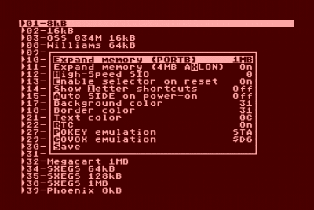

# AVGCART / SUBCART Cheat Sheet

A no-nonsense overview of hopefully all the keyboard shortcuts available
on the AVGCART / SUBCART for Atari 8-bit computers available from
[MiscRetro](https://miscretro.com/).

## Firmware Updates

The current firmware for AVGCART / SUBCART can be found here:
[currentfirmware.com](https://currentfirmware.com/).

The *.UPD files must be placed in the root directory of the SD card
and Ctrl+Shift+U be pressed to update.

## Main Menu

Key | Function
--- | --------
CAPS | Setup menu (see image above)
Return | Launch Atari with cart/disks/tape, BASIC off
Option+Return | Launch Atari, BASIC on
SPACE
Ctrl+Up | Top of Page
Ctrl+Down | Bottom of Page
Ctrl+Left | Top of List
Ctrl+Right | Bottom of List
Return or A-X | Launch file / Enter sub-directory
Start+Return | Load tape image, BASIC on |
Start+Option+Return | Load tape image, BASIC off |
Ctrl+Shift+Return | Jump back
Ctrl+Return | Jump into entry's directory |
Ctrl+Delete | Jump to root
? | About / Version information
Ctrl+C | Copy file |
Ctrl+D | Delete file |
Ctrl+R | Launch random file
Z | Scroll long entry title |
Shift+ESC | Disable AVGCART |
/ | Start recursive search |
Delete | Exit search |
TAB | Select / Unselect disk image or tape image |
Shift+TAB | Select / Unselect disk image and advance |
Ctrl+TAB | Clear all disk image assignments |
Shift+(1..4/8) | Assign disk image to disk drive (5..8 with SIO cable) |
0...9 | Launch shortcut |
Ctrl+(0...9) | Assign shortcut to selected entry |
Ctrl+Shift+(0...9) | Jump to shortcut location |
Ctrl+Shift+E | Auto-enable |
Ctrl+E | Disable auto-enable |
Ctrl+Shift+H | Enable HSIO (High-Speed SIO), select divisor |
Ctrl+H | Disable HSIO |
Ctrl+Shift+M | Enable Extended RAM on boot |
Ctrl+M | Disable Extended RAM |
Ctrl+Shift+N | Set autostart entry |
Ctrl+N | Clear autostart entry |
Shift+S | Enable IDE emulation and reboot |
Ctrl+Shift+S | Enable IDE emulation on power-up |
Strl+S | Disable IDE emulation |
Ctrl+T | Select template file (from _AVGTMPL directory) |
Ctrl+Shift+U | Update firmware, requires *.UPD files on SD card |

## AVGCART Buttons

Button | Function
------ | --------
Left button, then Reset | Return to main menu
Right button, then Reset | Re-init current cartridge / Cycle mounted disks
Right button on power-up | Disable IDE emulation
