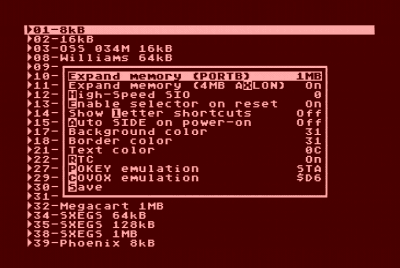

# AVGCART / SUBCART Cheat Sheet

A no-nonsense overview of hopefully all keyboard shortcuts available
on the AVGCART / SUBCART for Atari 8-bit computers from
[MiscRetro](https://miscretro.com/).

Much more information can be found at
[De Re AVGCART](https://atari8bit.net/tutorials/de-re-avgcart/).

## Keyboard Functions

Key | Function
--- | --------
Caps | Setup menu (see image above)
Return | Launch Atari with currently selected cart/disks/tape, BASIC off
Option+Return | Launch Atari, BASIC on
Space | Launch Atari with already assigned disks, BASIC off
Delete | Move one directory up / Exit search
Shift+ESC | Disable and exit CART
/ | Start recursive search
? | About / Version information
Up / Down | Move selection
Left / Right | Move selection by page
Shift+Up/Down | Top/Bottom of Page
Shift+Left/Right | Top/Bottom of List
Return or A-X | Immediately launch file (Via SIO / PBI/ECI / OSXEX2) / Enter sub-directory
Start+Return | Load tape image, BASIC on
Start+Option+Return | Load tape image, BASIC off
Shift+Return | Boot ATR with second best option (see Return)
Ctrl+Return | Jump into entry's directory
Shift+Ctrl+Return | Jump back / "[Stack](https://atari8bit.net/tutorials/de-re-avgcart/#Stacking_Cartridges)" selected cartridge on SpartaDOS X (requires SDX.ROM)
Ctrl+Delete | Jump to root
Z | Scroll long entry title (when immediate search is off)
TAB | Select / Unselect disk image or tape image
Shift+TAB | Select / Unselect disk image and advance
Ctrl+TAB | Clear all disk image assignments
Shift+(1..8) | Assign disk image to disk drive
Ctrl+(0...9) | Assign shortcut to selected entry
Shift+Ctrl+(0...9) | Jump to shortcut location
0...9 | Launch shortcut
Ctrl+C | Copy file to clipboard
Ctrl+D | Delete file (press Y to confirm)
Ctrl+E | Disable auto-enable
Shift+Ctrl+E | Auto-enable
Ctrl+H | Disable HSIO
Shift+Ctrl+H | Enable HSIO (High-Speed SIO) and select divisor
Ctrl+L | Switch between letter shortcuts and type-in search
Ctrl+M | Disable Extended RAM
Shift+Ctrl+M | Enable/disable Extended RAM on boot
Ctrl+N | Clear autostart entry
Shift+Ctrl+N | Set autostart entry
Ctrl+O | Copy file
Ctrl+R | Launch random file
Ctrl+S | Disable IDE emulation
Shift+S | Enable IDE emulation and reboot
Shift+Ctrl+S | Enable IDE emulation on power-up
Ctrl+T | Select template file (from _AVGTMPL directory)
Ctrl+V | Paste file in clipboard (from Ctrl+C)
Shift+Ctrl+U | Update firmware, requires *.UPD files on SD card

## Cartridge Buttons

Button | Function
------ | --------
Left button, then Reset | Return to main menu
Right button, then Reset | Re-init current cartridge / Cycle mounted disks
Right button on power-up | Disable IDE emulation

## Firmware Updates

The current firmware for AVGCART / SUBCART can be found at
[currentfirmware.com](https://currentfirmware.com/).

The *.UPD files must be placed in the root directory of the SD card
and Shift+Ctrl+U be pressed to update.
